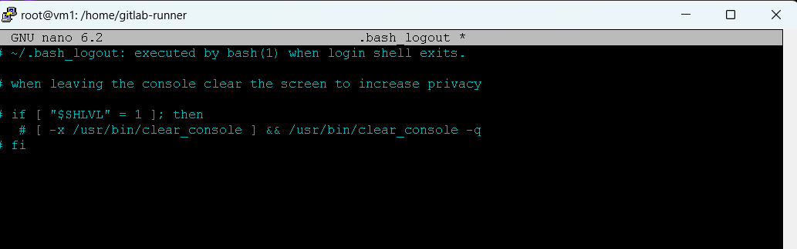
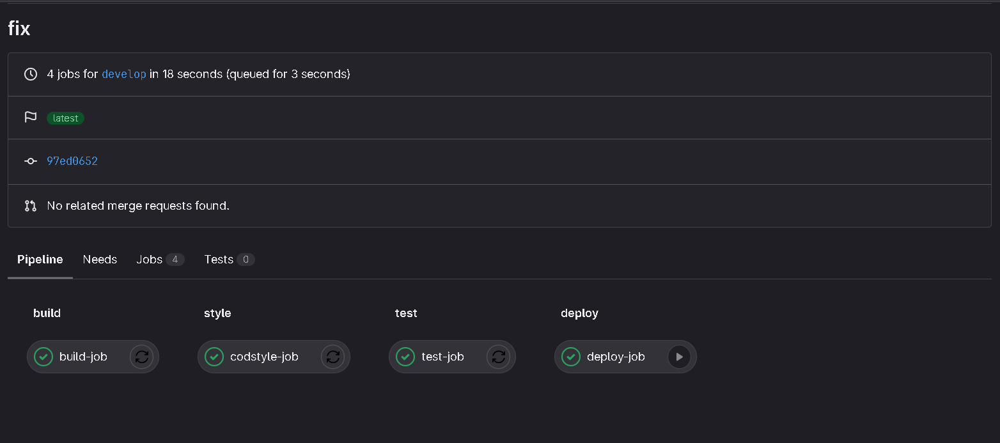

# Part 1. Настройка gitlab-runner

### Подними виртуальную машину Ubuntu Server 22.04 LTS.


### Скачай и установи на виртуальную машину gitlab-runner.

```
https://docs.gitlab.com/runner/install/linux-manually.html
```


### Запусти gitlab-runner и зарегистрируй его для использования в текущем проекте (DO6_CICD).


```
sudo apt install make
sudo apt install gcc
sudo apt install clang-format
```

# Part 2. Сборка

### Напиши этап для CI по сборке приложений из проекта C2_SimpleBashUtils: в файле gitlab-ci.yml добавь этап запуска сборки через мейк файл из проекта C2. Файлы, полученные после сборки (артефакты), сохрани в произвольную директорию со сроком хранения 30 дней.





# Part 3. Тест кодстайла

### Напиши этап для CI, который запускает скрипт кодстайла (clang-format). Если кодстайл не прошел, то «зафейли» пайплайн. В пайплайне отобрази вывод утилиты clang-format.


# Part 4. Интеграционные тесты

### Напиши этап для CI, который запускает твои интеграционные тесты из того же проекта. Запусти этот этап автоматически только при условии, если сборка и тест кодстайла прошли успешно. Если тесты не прошли, то «зафейли» пайплайн. В пайплайне отобрази вывод, что интеграционные тесты успешно прошли / провалились.


# Part 5. Этап деплоя

### Подними вторую виртуальную машину Ubuntu Server 22.04 LTS.


### Напиши этап для CD, который «разворачивает» проект на другой виртуальной машине. Запусти этот этап вручную при условии, что все предыдущие этапы прошли успешно. Напиши bash-скрипт, который при помощи ssh и scp копирует файлы, полученные после сборки (артефакты), в директорию /usr/local/bin второй виртуальной машины. В файле gitlab-ci.yml добавь этап запуска написанного скрипта. В случае ошибки «зафейли» пайплайн.


## Зададим нужные привилегии пользователю gitlab-runner - добавим его в группу sudo и разрешим запуск команд без пароля, выполнив команду:

```
sudo usermod -aG sudo gitlab-runner
```

### Меняем строки в файле /etc/sudoers, используя команду:

``` 
sudo visudo
```


### Перезапускаем сервер ssh выполнив команду:
```
sudo service ssh restart
```

### На первой машине генерируем ключ sudo -u root ssh-keygen


### Скопируем его на вторую машину командой





### Сохрани дампы образов виртуальных машин.


# Part 6. Дополнительно. Уведомления

### Настрой уведомления об успешном/неуспешном выполнении пайплайна через бота с именем «[твой nickname] DO6 CI/CD» в Telegram.


